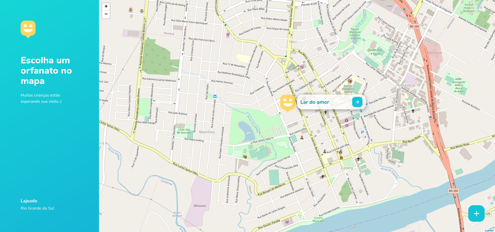
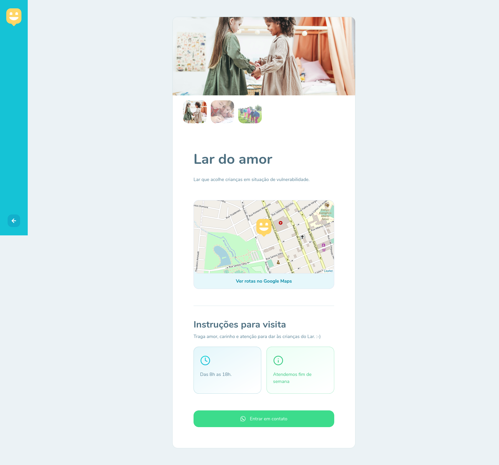
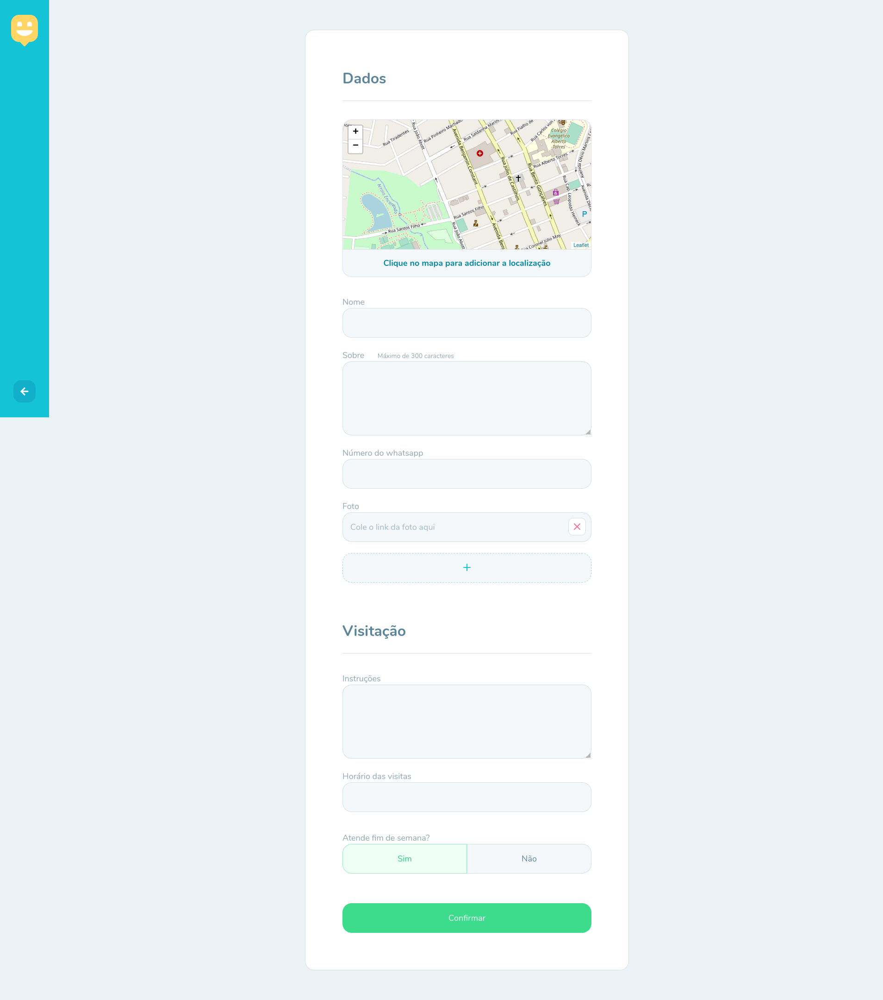

# Happy (web)

> Application that makes children adoption process easier for people!

This project was developed during the Next Level Week #3, from [RocketSeat](https://rocketseat.com.br).

## :computer: Web Screenshots






## :rocket: Technologies

- [Node.js](https://nodejs.org)
- [Express](https://expressjs.com)
- [SQLite](https://sqlite.org/index.html)
- [Handlebars](https://handlebarsjs.com/)
- [JavaScript](https://javascript.com)
- [CSS](https://developer.mozilla.org/en-US/docs/Web/CSS)
- [HTML](https://developer.mozilla.org/en-US/docs/Web/HTML)

## :construction_worker: How to run

```bash
# Clone repository
$ git clone https://github.com/martinigustavo/HappyProject.git
```

### Executing it

```bash
# Change directory to the project
$ cd HappyProject

# Install dependencies
$ npm install

# Start the application
$ npm start
```

On your browser access http://localhost:5500/ to see the results.